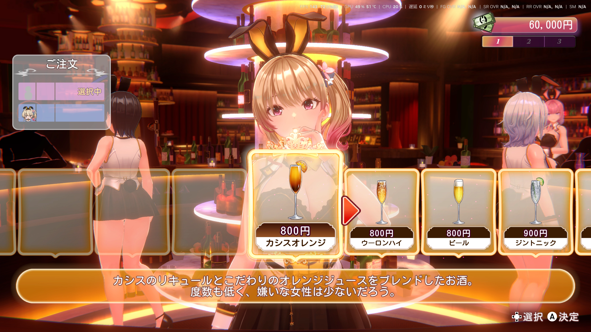
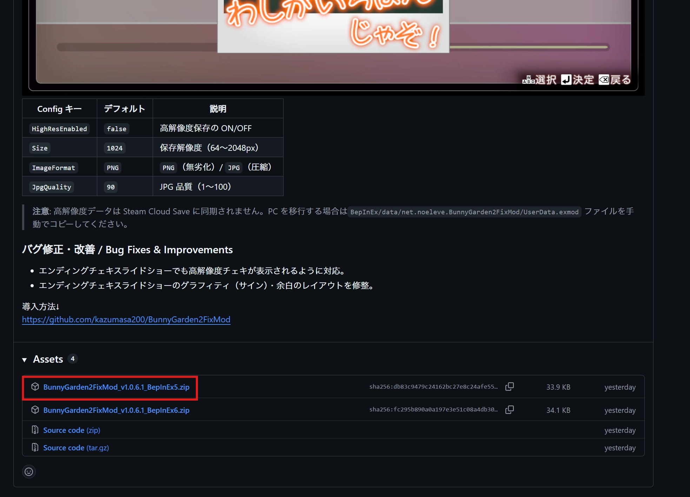
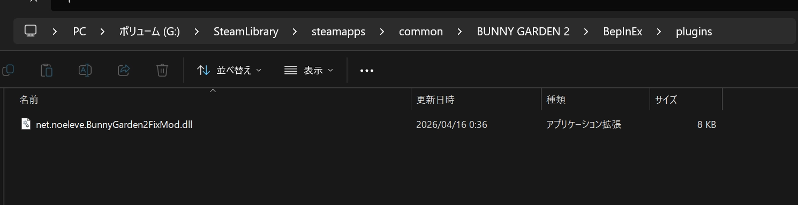
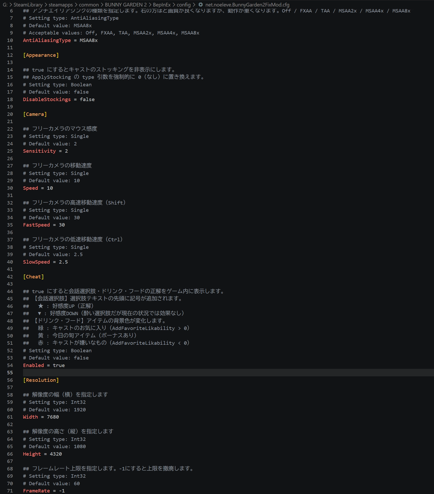

# BunnyGarden2FixMod

<div align="right">

[](README.md)&nbsp;[](README.en.md)

</div>

A BepInEx 5 mod for [Bunny Garden 2](https://store.steampowered.com/app/3443820/2/) that fixes the resolution, lets you change the frame rate cap, and more.





## Supported versions (as of mod v1.0.11)
- Supports game versions 1.0.5 and 1.0.6

## Features
- Improve image quality by setting a custom internal resolution.
- Change the frame rate cap (originally locked to 60) to any value, or remove it entirely.
- Set anti-aliasing to further reduce jaggies.
- Free camera. Supports keyboard/controller controls, time stop, and toggling the overlay display. You can also choose where the free camera image is output: main screen, PiP, or secondary monitor.
- Screenshot saving while in free camera. Saves a PNG without capturing the overlay display.
- Show the correct answers for drinks, food, and conversation choices. (disabled by default)
- Force stockings to be hidden. (disabled by default)
- Change the cast lineup order before entering the bar. (disabled by default)
- Save cheki (photos) at high resolution. (disabled by default)
- Freely switch costumes, panties, and stockings with the F7 key. Includes a Costume Changer feature that transplants another character's top/bottom. (enabled by default)
- Hide the money UI, button guide, and love counter in travel and special scenes with the F9 key. (hiding money is enabled by default)
- Disable the chromatic aberration effect (color fringing at screen edges). (disabled by default)
- Option to flatten the chest shape. Adjustable per character. (disabled by default)

The mod's own UI (F9 settings panel, Costume Changer, etc.) automatically follows the game's language setting (Japanese / English / Simplified Chinese / Traditional Chinese). See [Translations](#translations-localization) below to add more languages.

## How to install (Steam Deck supported)
1. Download the latest zip from [Releases](https://github.com/kazumasa200/BunnyGarden2FixMod/releases/latest). (something like `BunnyGarden2FixMod_v1.0.6.1_BepInEx5.zip`) Note that some browsers may block it.<br>Use the latest version available at the time of installing.




The image above is an example for v1.0.6.1. Choose the latest version at the time of installing.
> [!NOTE]
> If you're unsure whether to use BepInEx 5 or BepInEx 6, or if this is your first time installing a mod, download the one labeled BepInEx 5.
> The steps below assume the BepInEx 5 version.

2. Download [BepInEx 5](https://github.com/bepinex/bepinex/releases). On both Windows and Steam Deck, download ```BepInEx_win_x64_{version}.zip```.

3. Extract the entire contents of the BepInEx 5 zip into the directory that contains the game's exe. Don't forget the loose files in addition to the folders. In other words, the game's exe, the BepInEx folder, doorstop_config, etc. should all be at the same level.




4. (Steam Deck only) In Steam, right-click Bunny Garden 2 → "Properties" → "General" → "Launch Options", and enter ```WINEDLLOVERRIDES="winhttp=n,b" %command%```.

5. After launching the game once from the Steam Play button, extract the zip you downloaded from [Releases](https://github.com/kazumasa200/BunnyGarden2FixMod/releases/latest) and put the ```net.noeleve.BunnyGarden2FixMod.dll``` inside it into the Plugins folder within the BepInEx folder.


> [!IMPORTANT]
> Put it **inside the `BepInEx/plugins/` folder**, not directly under `BepInEx/`.

6. Launch again and a config file ```net.noeleve.BunnyGarden2FixMod.cfg``` will be created in the config folder inside the BepInEx folder. Edit it with a text editor like Notepad to configure the resolution, frame rate, and so on.





The image above is just an example. Configure it to your liking.


## Config list

Once you launch the game, `BepInEx/config/net.noeleve.BunnyGarden2FixMod.cfg` is generated.

**For the full list and details, see [here](docs/configs.md)** (auto-generated from [`Configs.yaml`](BunnyGarden2FixMod/Configs.yaml)).

While the game is running, you can also open the settings panel with the **F9** key and edit many items directly (reload with the `F4` key).

## Tips

- You can reload the config file while the game is running with the **F4 key**. After editing the config file, you don't need to restart the game (just press F4).

## Translations (localization)

The mod UI ships with Japanese (built-in) and English. It picks a language automatically based on the game's language setting.

You can add or override translations **without rebuilding** by placing an external language file at:

```
BepInEx/plugins/BunnyGarden2FixMod/lang/<code>.json
```

- `<code>` is one of `en` / `zhCN` / `zhtw` (and `ja` is the built-in default).
- The file is a flat JSON dictionary mapping the original Japanese string to the translated string. If a key is missing, it falls back to Japanese.
- The external file takes priority over the bundled translation, so you can also tweak existing translations.

Pull requests adding `zhCN.json` / `zhtw.json` and other languages are welcome.

## For developers: adding a Config / hotkey
<details>
<summary>Developer details</summary>

You can add a new setting just by writing one block in [`BunnyGarden2FixMod/Configs.yaml`](BunnyGarden2FixMod/Configs.yaml). At build time, `tools/ConfigGen` reads the YAML and regenerates [`Generated/Configs.g.cs`](BunnyGarden2FixMod/Generated/Configs.g.cs), and it's bound to BepInEx via `Configs.BindAll(Config)` in `Plugin.Awake` (the F9 panel row is added automatically via metadata too).

### Adding a Config entry

Add it under the relevant `section:` in `Configs.yaml`.

**bool / int / float**:

```yaml
- name: NewToggle              # static field name → Configs.NewToggle
  label: New toggle label      # F9 panel display name + first line of the .cfg description
  type: bool                   # bool / int / float / enum / hotkey
  default: false
  description: A note explaining what the toggle does.
  ui:                          # specify if you want a row in the F9 panel (optional)
    kind: toggle               # or slider
```

**Slider (numeric + range)**:

```yaml
- name: NewSlider
  label: New slider
  type: float
  default: 0.5
  range: [0.0, 1.0]
  description: Description.
  ui:
    kind: slider
    step: 0.1
    format: '{0:F2}'           # C# format specifier
```

**enum**:

```yaml
- name: NewMode
  label: Mode selection
  type: enum
  enumType: BunnyGarden2FixMod.MyMode  # fully-qualified enum type name
  default: ModeA
  description: Description.
```

### Adding a hotkey

Using `type: hotkey` **automatically expands into 2 entries in the .cfg, Keyboard + Gamepad**, and the field is wrapped in `HotkeyConfig`.

```yaml
- name: MyToggle
  label: Some toggle
  key: ToggleSomething              # expands in the .cfg with the XxxKey / XxxButton suffixes
  type: hotkey
  defaultKey: F8                    # a UnityEngine.InputSystem.Key name
  defaultButton: Y                  # a ControllerButton name (omit for keyboard only)
  description: Shared description (shown for both KB/Pad).
  controllerDescription: Requires holding ControllerModifier at the same time.  # Pad-only note (optional)
```

### Referencing from patch code

```csharp
using BunnyGarden2FixMod;

if (!Configs.NewToggle.Value) return;            // bool / int / float / enum
var v = Configs.NewSlider.Value;
if (Configs.MyToggle.IsTriggered()) { ... }      // hotkey: KB or Pad pressed
if (Configs.MyToggle.IsHeld()) { ... }
```

### Build and apply

```bash
dotnet build BunnyGarden2FixMod/BunnyGarden2FixMod.csproj         # BepInEx 5
dotnet build BunnyGarden2FixMod/BunnyGarden2FixMod.csproj -p:BepInExVersion=6  # BepInEx 6
```

An MSBuild target detects changes to the YAML / ConfigGen itself and regenerates `Generated/Configs.g.cs` automatically. When you copy `net.noeleve.BunnyGarden2FixMod.dll` into `BepInEx/plugins/`, the new entries are written to the `.cfg` on game launch and a row is automatically added to the F9 panel.
</details>

## For developers: testing
<details>
<summary>Developer details</summary>

`BunnyGarden2FixMod.Tests/` (xUnit) unit-tests **pure functions**. The targets are logic that depends only on UnityEngine's `Vector3` / `Mathf` etc. and `System`, verified against the real `UnityEngine.CoreModule.dll`. Code that depends on BepInEx / Harmony / Plugin is out of scope (verified visually in-game).

### Running

Run from the repository root.

```bash
dotnet test BunnyGarden2FixMod.Tests/BunnyGarden2FixMod.Tests.csproj
```

- The target framework is `net9.0`.
- It references the real `UnityEngine.CoreModule.dll`. The default path is Steam's `BUNNY GARDEN 2_Data/Managed`. If you installed elsewhere, override it with `-p:UnityManagedDir="C:/path/to/BUNNY GARDEN 2_Data/Managed"`.
- If the dll can't be found, the csproj's `CheckUnityManagedDir` target emits an error explaining the cause.

### Adding a test

1. Prepare the target as a **pure function** (depends only on UnityEngine + System, doesn't reference BepInEx types).
2. Add one line to the `Compile Include` `ItemGroup` in `BunnyGarden2FixMod.Tests.csproj` to directly link the source (don't reference the main dll).

   ```xml
   <Compile Include="../BunnyGarden2FixMod/Patches/.../Foo.cs" Link="Linked/Foo.cs" />
   ```

   `internal` types are accessible since they're compiled into the same assembly.
3. Create `BunnyGarden2FixMod.Tests/FooTests.cs` (`using Xunit;` and `using` the target namespace).
4. Run with `dotnet test ...`.

Examples: `SpatialGridIndexTests.cs` (links and tests `SpatialGridIndex.cs`), `SmokeTest.cs` (toolchain check).
</details>

## Known issues
Please check the [Issues](https://github.com/kazumasa200/BunnyGarden2FixMod/issues). If you find bugs, have improvements, or want a feature, please reach out via [Issues](https://github.com/kazumasa200/BunnyGarden2FixMod/issues) or [X](https://x.com/kazumasa200).
When requesting something, please create a separate issue from "New Issue" in the top right.

## Contact
X (formerly Twitter): @kazumasa200
Feel free to use this mod for live streaming, screenshots, and video recording. However, please follow the game's own guidelines. Credit is not required.
